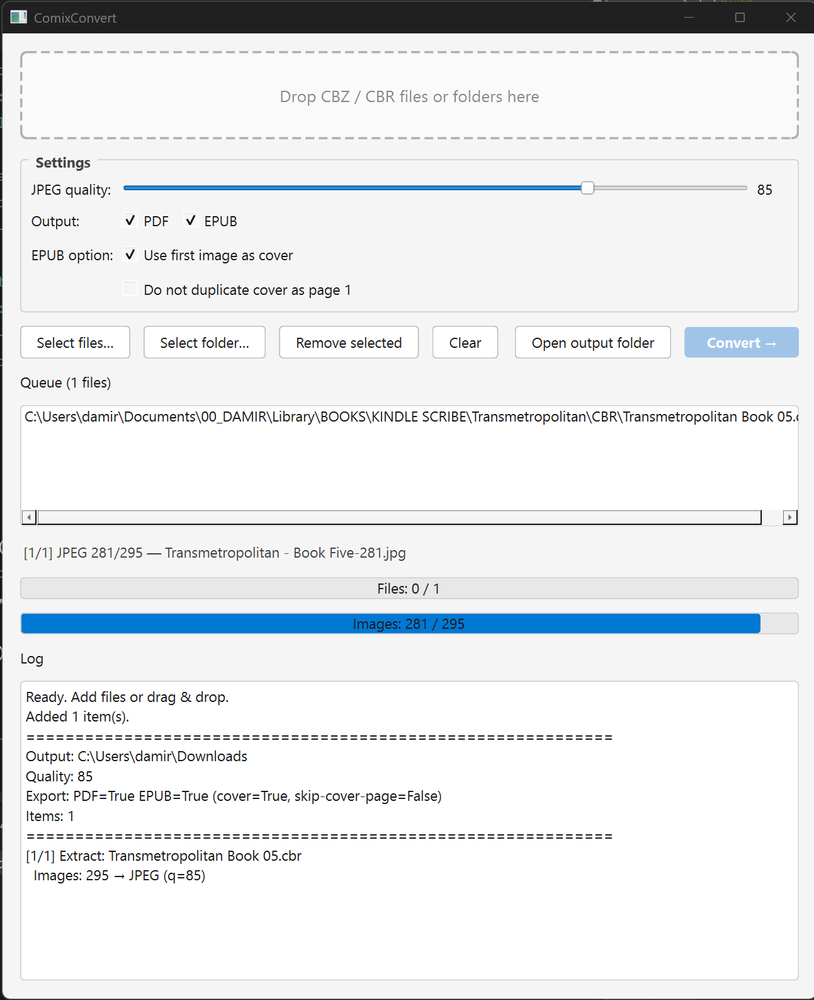

# ComixConvert

**ComixConvert** is a lightweight desktop tool for converting comic archives  
(**CBR / CBZ**) into **PDF and EPUB** formats.

It focuses on predictable output, batch processing, and control over image quality, without relying on ImageMagick or Calibre.



---

## Features

- Convert **CBR / CBZ → PDF**
- Convert **CBR / CBZ → EPUB**
- Drag & drop files and folders
- Recursive batch processing
- Adjustable JPEG quality (default: 85)
- EPUB support with **first image as cover** (optional)
- One image per page (no image splitting)
- Built-in log window
- Multi level progress bar

---

## Dependencies

### Runtime (for source usage)

- **Python 3.10+**
- **7-Zip** (required for CBR/CBZ extraction)

### Python packages

```bash
pip install pillow img2pdf tkinterdnd2
```

### License

- MIT