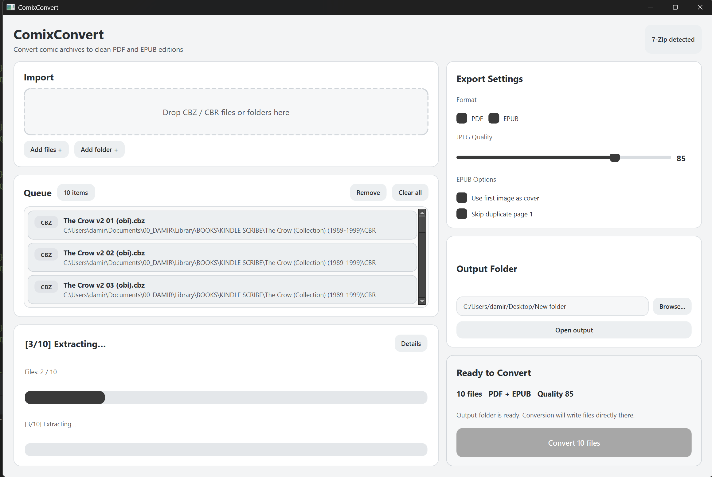

# ComixConvert

**ComixConvert** is a desktop app for converting comic archives (`.cbz`, `.cbr`, `.zip`, `.rar`) into **PDF** and **EPUB**. It is built with **PyQt6** and focuses on predictable output, batch processing, and simple control over image quality.

> [!IMPORTANT]
> ComixConvert needs [7-Zip](https://www.7-zip.org/download.html) to extract archives. Install it in the default location or add `7z` to your `PATH`. If the app shows **7-Zip missing** in the top right corner, it could not find it.

<p align="center">
  
</p>

## Download

Get `ComixConvert.exe` from the [latest release](https://github.com/damir-gavric/ComixConvert/releases/latest). It is a single Windows executable, so there is nothing to install, but you still need 7-Zip.

## Features

- Convert comic archives to **PDF**, **EPUB**, or both in one run
- Drag and drop files or folders
- Recursive folder scan for supported archives
- Adjustable JPEG quality
- EPUB cover from the first image, with an option to skip the duplicate first page
- Progress bars and a details log
- Remembers the output folder and export settings between runs

## Run from source

Requires **Python 3.10+** and 7-Zip.

```powershell
py -3 -m venv .venv
.venv\Scripts\python -m pip install -r requirements
.venv\Scripts\python main.py
```

## Build the EXE

Using the `.venv` from above:

```powershell
.venv\Scripts\python -m pip install pyinstaller
.venv\Scripts\python -m PyInstaller --noconfirm --clean --onefile --windowed --name ComixConvert --icon assets\app_icon.ico --add-data "assets\app_icon.svg;assets" main.py
```

The executable is written to `dist\ComixConvert.exe`.

## Notes

- Pages are re-encoded to JPEG, so the quality setting applies to every page.
- Output files are named after the archive (`Comic.cbz` → `Comic.pdf`, `Comic.epub`). If two archives in one batch share a name, the second one is saved as `Comic (2).pdf` / `Comic (2).epub`.
- Files that already exist in the output folder are overwritten.

## License

[MIT](LICENSE)
